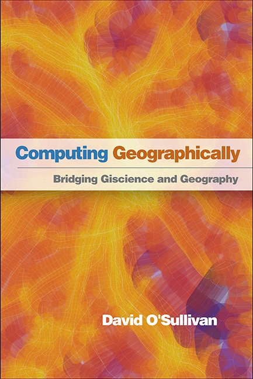

### Coming soon...
<a href="#geographic-information-analysis">[_Computing Geographically_](https://www.guilford.com/books/Computing-Geographically/David-O'Sullivan/9781462553938) argues for the importance of giscience taking geography seriously, and also for geography taking giscience more seriously. Too much giscience is conducted as if $(x,y)$ were all that is needed to make data geographical; equally far too many geographers think that that is all that giscience does. This book aims to bridge the divide. The manuscript is with the publishers ([Guilford Press](https://www.guilford.com)) at the time of writing (July 2023), and I expect the book will appear in early 2024.

<a href="#spatial-simulation-exploring-pattern-and-process">
[_Spatial Simulation: Exploring Pattern and Process_](http://www.wiley.com/WileyCDA/WileyTitle/productCd-1119970792.html) with [George Perry](http://www.env.auckland.ac.nz/people/george-perry) perhaps requires a little more explanation. It provides an advanced introduction to simple spatial simulation models for researchers in fields such as geography, planning, archaeology, ecology and so on. George and I felt that such models have great potential across the 'spatial sciences' but that the literature on them is scattered, which makes it a challenge for researchers in these fields to get started. We read all those mathematics, physics and statistics papers, so you don't have to! A library of models which you can run in [NetLogo](http://ccl.northwestern.edu/netlogo/) accompanies the book, and can be downloaded from [this repository](https://github.com/DOSull/model-zoo) or explored at [patternandprocess.org](https://patternandprocess.org).

<a href="#geographic-information-analysis">
[_Geographic Information Analysis_](http://www.wiley.com/WileyCDA/WileyTitle/productCd-0470288574.html) with Dave Unwin, was first published in 2003, with a second edition in 2010, and we're thinking about a third. It has been a mainstay of my teaching through all that time, and currently underpins much of the content of [GISC 422 Spatial Analysis and Modelling](https://github.com/DOSull/GISC-422).

