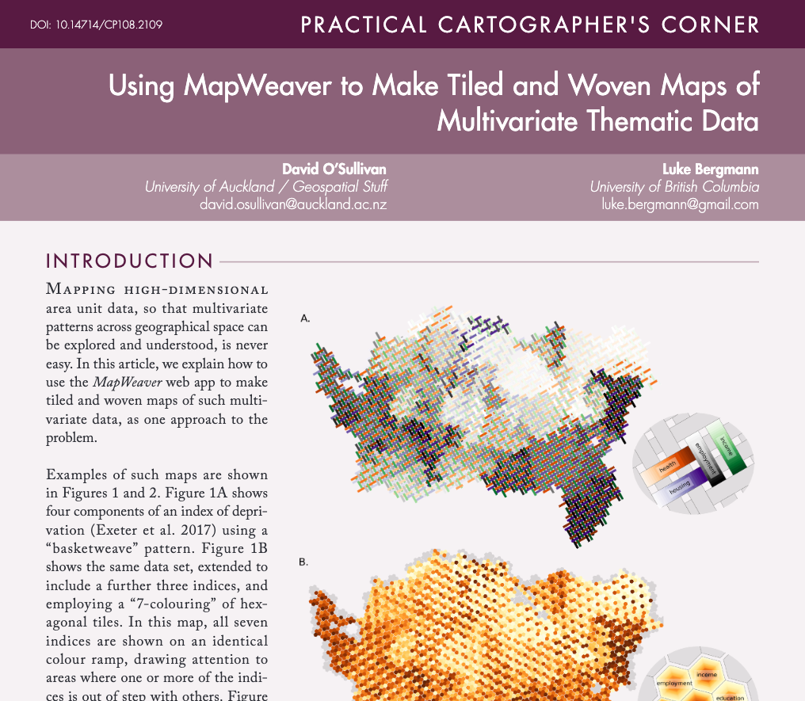

I've posted a [couple](https://geospatialstuff.com/posts/2025/03/09/mapweaver-beta/) of [times](https://geospatialstuff.com/posts/2025/05/22/python-meetup-talk/) about [_MapWeaver_](https://geospatialstuff.com/mapweaver/app/) the app I built using [marimo](https://marimo.io) to make it easy(ish) to make multivariate thematic maps based on tiled and woven patterns.

We've written a short article on how to use the app. The app is free to use, and the article is freely available thanks to the good people at [_Cartographic Perspectives_](https://cartographicperspectives.org/index.php/journal).

Here's the citation details, and a link: 

::: {.bib}
**O'Sullivan D** and L Bergmann. 2026. Using MapWeaver to Make Tiled and Woven Maps of Multivariate Thematic Data. _Cartographic Perspectives_ **108**. doi: [10.14714/CP108.2109](https://doi.org/10.14714/CP108.2109). 
:::

To really dig into making such maps you might still need to write some code using the python [`weavingspace`](https://github.com/DOSull/weavingspace) module, BUT MapWeaver handles almost all use-cases and let's you export your map to PNG, SVG, geojson or geopackage formats for further design work in your preferred graphical or cartographic platform.

If you're interested in this approach to mapping, and are looking for advice from the world's most experienced^[While writing the code I have made literally thousands of these maps!] tiled/woven thematic map maker, get in touch!