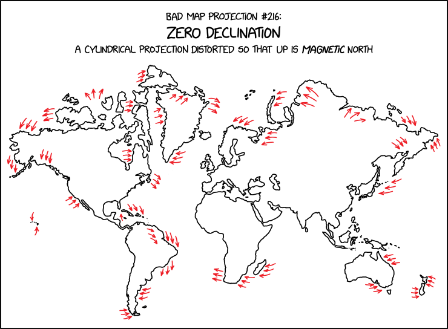
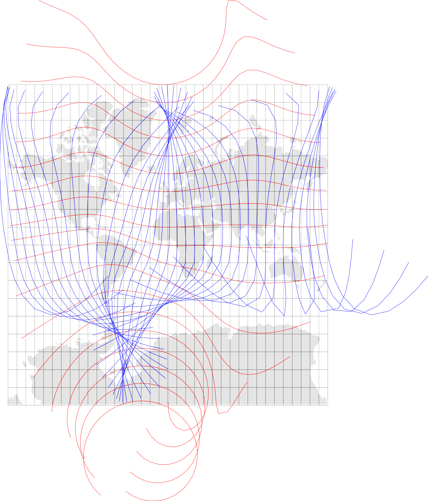
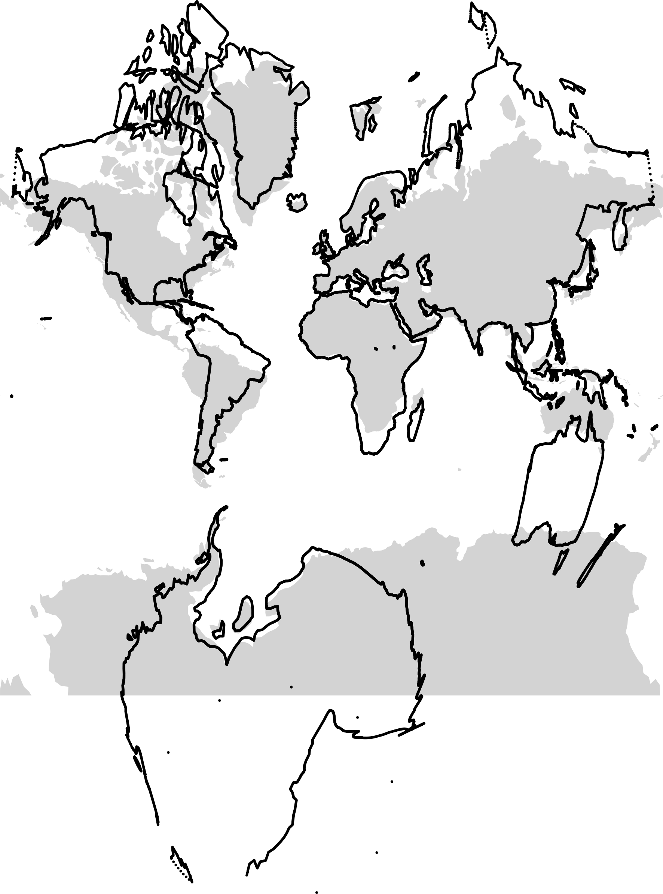

::: {#fig-xkcd-3207 fig-cap="alt-text: 'The zero line in WMM2025 passes through a lot of population centers; I wonder what year the largest share of the population lived in a zone of less than 5° of declination', he thought, derailing all other tasks for the rest of the day."}

:::

I have been afflicted by a different version of the alt-text where replicating the map derailed all other tasks for more time than I care to admit.

```{r}
#| label: imports-and-data
#| output: false
library(dplyr)
library(tidyr)
library(stringr)
library(sf)
library(terra)
library(ggplot2)
library(patchwork)
library(cols4all)
library(igrf)
library(igraph)
library(ggraph)
library(akima)

w_polygons <- st_read("world-polygons.gpkg")
w_pts <- st_read("world-points.gpkg")
```
## Code, code, code... so much code
This is a case where the 'backwards' reactive structure of [marimo](https://marimo.io) or [observable](https://observablehq.com/) notebooks would be nice. Then I could put all the helper functions that do the work at the end of the document, and readers could check them out if they wanted to. In the R markdown / Quarto case, the best I can do is put all that code in a source file, which you can take a look at [here](xkcd-3207-functions.R). 

```{r}
#| code-fold: show
source("xkcd-3207-functions.R")
```

But beware: here be dragons... and you are on your own figuring out what the heck is going on. Suffice to say, I've become more comfortable with R's matrices and situations where base R's vectors, matrices, and lists might be preferable to the tidyverse's more or less exclusive focus on tabular data. I also realised after a while that working in Python might have been a better choice once things got messy.

With all that code glossed over, and set to one side we can get into the ahem... serious business of replicating the zero declination map projection.

## Mappinmg magnetic declination
Before doing so, it's good to get a handle on the problem. First up a map of magnetic declination. This makes use of a `get_point_grid()` function in the aforementioned source file. That function makes a point grid and also retrieves the declination values at each lat-lon location using the [`igrf::igrf()`](https://www.rdocumentation.org/packages/igrf/versions/2.0/topics/igrf) function. Here's a snippet of what the resulting data look like.

```{r}
#| label: get-point-grid-1
#| code-fold: show
xsteps <- 90; ysteps <- 90
grid_90 <- get_point_grid(xsteps, ysteps)
grid_90$grid |> head()
```

And we can map and contour this.

```{r}
#| label: fig-declinations-map
#| fig-cap: Magnetic declination based on the model described in Alken et al. 2021.[^1] Contours are at 5&deg; intervals, with negative declinations in reds, positive declinations in blues, and the isogonic line where magnetic north and true north are exactly aligned in green.
#| fig-width: 9
#| fig-height: 9
ggplot() +
  geom_sf(data = w_polygons, fill = "white", colour = NA) +
  geom_contour(data = grid_90$grid, breaks = -35:35 * 5,
    aes(x = x, y = y, z = D, 
        colour = ifelse(after_stat(level) == 0, "seagreen",
                        ifelse(after_stat(level) < 0, "red3", "darkblue")),
        linewidth = ifelse(after_stat(level) == 0, .7, .2))) +
  scale_colour_identity() +
  scale_linewidth_identity() +
  metR::geom_text_contour(data = grid_90$grid, aes(x = x, y = y, z = D),
                          breaks = -35:35 * 5, skip = 1, size = 3) +
  coord_sf(expand = FALSE) +
  theme_void() +
  theme(panel.background = element_rect(fill = "lightgrey", colour = NA))
```

[^1]: Alken P, E Thébault, CD Beggan, _et al._ 2021. [International Geomagnetic Reference Field: the thirteenth generation](https://dx.doi.org/10.1186/s40623-020-01288-x). _Earth, Planets and Space_ **73**(1): 49.

It's interesting that so many of the more populous parts of the world have low declinations, and hence relatively 'accurate' compasses. It's also very helpful. Later, I remove all the non-land areas from consideration, leaving the focus on relatively low declination areas, which are more amenable to deformations that don't get too out of hand.

As a side-note, the most recent release of the world magnetic model came out towards the end of last year (I assume this is what prompted the XKCD map), and you can download data based on that model from the [US National Centers for Environmental Information](https://www.ncei.noaa.gov/) at [this page](https://www.ngdc.noaa.gov/geomag/calculators/magcalc.shtml). The R package `igrf` provided data remains to be updated to the latest magnetic model. But the previous model is not that old, and I can use it to get data for 2025 anyway, which is plenty good enough, and is what is shown in the map.

I am using the widely derided Mercator projection for a number of reasons. First, we are in the business here of bad map projections. Second, the XKCD map seems clearly to be derived from a Mercator projection. And third, and most importantly (and seriously), we'll be doing local angular deformation of areas, and a conformal projection seems the most appropriate place to start for that (never let it be said that Mercator is not useful).

## Imagine doing this with actual maps
To get a handle on the problem it's helpful to imagine assembling a bunch of rectangular paper maps of the planet and arranging them in a grid, each rotated by an amount that offsets the local magnetic declination so that 'up' on each map sheet is magnetic north. The code cell below makes a bunch of 'map sheets'.

```{r}
#| label: map-sheets-1
#| code-fold: show
grid_45 <- get_point_grid(45, 45)
xy_r <- rast(grid_45$grid |> select(x, y, D, lon, lat), 
             type = "xyz", crs = "+proj=merc")
sheets <- xy_r |>
  as.polygons(aggregate = FALSE) |>
  st_as_sf() 
sheets <- sheets |> 
  bind_cols(sheets |> 
              st_centroid() |>
              st_coordinates() |>
              as.data.frame() |>
              rename(xo = X, yo = Y))
```

And we can get a feel for the required rotation of each sheet by mapping it.

```{r}
#| label: fig-map-sheets
#| fig-cap: Map sheets coloured by the declination at the centroid.
#| fig-width: 11
#| fig-height: 10
ggplot() +
  geom_sf(data = w_polygons, fill = "white", colour = NA) +
  geom_sf(data = sheets |> st_filter(w_polygons), aes(fill = D),
          alpha = 0.75, colour = "white") +
  scale_fill_continuous_c4a_div("scico.roma_o", mid = 0, limits = c(-180, 180)) +
  geom_contour(data = grid_90$grid, aes(x = x, y = y, z = D),
               breaks = -35:35 * 5, colour = "darkgrey", lwd = 0.2) +
  coord_sf(expand = FALSE) +
  guides(colour = "none") +
  theme_void() +
  theme(
    panel.background = element_rect(fill = "lightgrey", colour = NA))
```

It's evident that Antarctica is going to be even more of a problem than usual in this project.^[That's why I ditch it later.]

### Rotate the map sheets
Functions I wrote in the linked source file allow us to rotate the maps sheets, and here's what we get if we rotate each map independently keeping them in their position in the overall grid.

```{r}
#| label: fig-map-sheets-rotated
#| fig-cap: How we might rotate a collection of maps sheets so that magnetic north is up.
#| fig-width: 10
#| fig-height: 10
maps <- sheets |> 
  st_intersection(w_polygons) |>
  filter(st_geometry_type(geometry) != "GEOMETRYCOLLECTION")

maps_p <- mapply(rotate_shape, 
                 s = maps$geometry, a = -maps$D, 
                 xo = maps$x, yo = maps$y, 
                 SIMPLIFY = FALSE) |>
  st_sfc() |>
  data.frame() |>
  st_sf(crs = "+proj=merc") 

ggplot() + 
  geom_sf(data = w_polygons, colour = NA) +
  geom_sf(data = maps_p, fill = "red", colour = "black", alpha = 0.15, lwd = 0.1) +
  geom_contour(data = grid_90$grid, aes(x = x, y = y, z = D),
               breaks = -35:35 * 5, colour = "black", lwd = 0.15) +
  coord_sf(expand = FALSE) +
  guides(colour = "none") +
  theme_void()
```

Comparing this with @fig-xkcd-3207 the most obvious congruence is with the map sheets in southern Africa which have rotated clockwise.^[Almost inevitably, New Zealand has not fared well in this exercise.]

However, an obvious issue on closer inspection is the regions in each map sheet no longer align with one another to form properly connected areas. This effect is clear in the map below.

```{r}
#| label: fig-map-sheets-rotated-closeup
#| fig-cap: A closer look at rotated map sheets in southern Africa.
#| fig-width: 10
#| fig-height: 7
ggplot() + 
  geom_sf(data = w_polygons, colour = NA) +
  geom_sf(data = maps_p, fill = "red", colour = "black", alpha = 0.15) +
  geom_contour(data = grid_90$grid, aes(x = x, y = y, z = D),
               breaks = -35:35 * 5, colour = "black", lwd = 0.2) +
  coord_sf(xlim = c(0, 5e6), ylim = c(-4.4e6, -1e6), expand = FALSE) +
  guides(colour = "none") +
  theme_void()
```

You can imagine shifting those map sheets around to make them line up, but it's not a simple task since the map sheet sides are not parallel&mdash;they are not off my much, but they're not parallel!

Long story short, the required projection is not a simple one.

## A crude trigonometric approach
How to proceed? My first somewhat successful effort was to rotate sections of the world map not around localised centres as has been done for the map sheets above, but around some more global centre that would enable contiguity to be preserved between contiguous places. Exploring that path led to the best effort below.

```{r}
#| label: do-trig-based-projection
#| code-fold: show
w_proj <- w_pts |>
  st_drop_geometry() |>
  bind_cols(
    mapply(project_point, x = w_pts$x, y = w_pts$y,
           a = -w_pts$D / 2 * cos(w_pts$lat * pi/180),
           xo = w_pts$x, yo = 0) |>
      unlist() |>
      matrix(ncol = 2, byrow = TRUE) |>
      as.data.frame() |>
      rename(Xp = V1, Yp = V2)) |>
  st_as_sf(coords = c("Xp", "Yp"), remove = FALSE, crs = 4326) |>
  st_transform("+proj=merc")
```

The central feature here is using the `project_point()` function (you'll find this in the linked R source file from earlier) to rotate each point through some angle `a` about a point given by `xo` and `yo`. Experimentation led me to make that centre of rotation a point on the equator at the same longitude as the point to be rotated. That's not necessarily unreasonable. What's more than a little strange is that to get a result similar to the XKCD map^[Ground truth?!] I'm rotating by _half_ the declination, with a further reduction in the angle scaled by the cosine of the latitude. The cosine scaling is vaguely justifiable given that that is the linear scaling error at a given latitude in the Mercator projection, but I'm really not sure why I would have to halve the angle of rotation in addition to this 'correction'. 

Anyway, here's what the resulting map looks like:

```{r}
#| label: fig-trig-based-projection
#| fig-cap: A trigonometry based rendition of a zero declination projection.
#| fig-width: 10
#| fig-height: 9
ggplot() +
  geom_sf(data = w_polygons, fill = "lightgrey", colour = NA) +
  geom_point(data = w_proj, aes(x = Xp, y = Yp), size = 0.25) +
  coord_sf(expand=FALSE) +
  theme_void()
```

I'm not sure what happened to a big chunk of Antarctica (and this is _almost_ the last time I'll be dealing with it in this post), but overall this isn't a terrible approximation to the XKCD map.

And that, dear reader, is probably where I should have stopped...

## An approach based on a 'deformed' graticule
Unfortunately, this problem got in my head, and I couldn't let it go.^[Late breaking: a [response to this post](https://spatialists.ch/posts/2026/03/18-zero-declination-please/) alerted me to the fact that I got [_nerd-sniped_](https://xkcd.com/356/) by XKCD, which is so meta- it hurts.]

My overall approach was to generate a deformed latitude-longitude graticule that respects the magnetic declination along each deformed parallel and meridian, and then to use that as a basis for an interpolation from Mercator to a zero-declination map using the method described in [this post](https://computinggeographically.org/chapters/chap2/fig2-02-cartograms.html) and [this one](https://geospatialstuff.com/posts/2021/10/21/experiments-with-r-interpolators/).

This led me down some pretty paths. For example, here's a map showing a set of 'deformed' parallels (in red) and meridians (in blue):

::: {#fig-deformed-meridians-and-parallels fig-cap="A graticule formed by independently deformed meridians and parallels."}


:::

And here's the projection I get using those:

::: {#fig-deformed-meridians-and-parallels-projection fig-cap="A map produced using the deformed graticule of @fig-deformed-meridians-and-parallels."}


:::

The problem here is that the meridians and parallels have been independently deformed by stringing together equal length segments at the appropriate angles to E-W (for parallels) or N-S (for meridians). Instead of this they should be knit together with their points of intersection shifted around to yield the right bearings along their lengths. In places that will mean shortening the segments or lengthening them to maintain the grid characteristic of the graticule (the next section makes this clearer).

At this point I thought I might find some assistance in work on [curvilinear grids](https://en.wikipedia.org/wiki/Curvilinear_coordinates) but no such luck. It seems likely that there's something out there _somewhere_, but I didn't find it. This was a fun digression: [rheotomic surfaces](https://spacesymmetrystructure.wordpress.com/2009/02/06/rheotomic-surfaces/) but led nowhere.

Never mind, onward!

### Make a new grid and graticule
Before going any further, we make a new grid, and this time also make a graticule of parallels and meridians. Note that I am cutting off this grid at 60&deg;S.

```{r}
#| label: make-final-grid
#| code-fold: show
xsteps <- 90; ysteps <- 90
grid_points <- get_point_grid(xsteps, ysteps, lat0 = -60)
graticule <- get_parallels_and_meridians(grid_points)

# get initial corners for all graticule cells
corners <- matrix(ncol = 0, nrow = 2, dimnames = list(c("x", "y")))
for (r in 1:ysteps) {
  for (c in 1:xsteps) {
    corners <- cbind(corners, get_cell(r, c, TRUE))
  }
}
corners[, 1:10]
```

The `corners` matrix is a 2-row (`x`, `y`) many-columned matrix of all the points at the corners of each 'cell' in the graticule. The points are designated as SW, SE, NE, NW corners of their respective cells. I switched to matrices at this point as I found it a lot easier to do manipulations of these directly than fishing around inside `sf` polygons for the underlying matrix data. It meant I had to write some simple functions for 'mapping' points as polygons using `ggplot2::geom_polygon()` but that was a small price to pay. I also found that manipulating matrices like these was generally snappier than manipulating `sf` objects.

What's hidden underneath the above code are functions to represent the segments of meridians and parallels as straight line equations in [$Ax+By+C=0$ format](https://mathworld.wolfram.com/StandardForm.html), along with functions to intersect such lines. This is what enables creation of 'deformed' cells with each side at the appropriate angle.

### Dataframe for visual checking
So... make a dataframe from the `corners` matrix, and plot it:

```{r}
#| label: fig-all-cells-initial-state
#| fig-cap: The starting state of the lattice with each lattice cell 'deformed' to a quadrilateral with its edges at at appropriate orientiations.
#| fig-width: 10
#| fig-height: 7
df <- cells_as_dataframe(corners)

ggplot() +
  geom_sf(data = w_polygons, fill = "lightgrey", lwd = 0.25, colour = "white") +
  geom_polygon(data = df, aes(x = x, y = y, group = id), 
               fill = "#ff000040", colour = "black", lwd = 0.15) +
  coord_sf(xlim = range(df$x), ylim = range(df$y), expand = FALSE) +
  theme_void()
```

In closeup we get a better idea of how this differs from the rotated map sheets of @fig-map-sheets-rotated:

```{r}
#| label: fig-cells-initial-state-closeup
#| fig-cap: A closeup view of the starting state of the deformed grid of parallel-meridian cells.
#| fig-width: 10
#| fig-height: 7
ggplot() +
  geom_sf(data = w_polygons, fill = "lightgrey", lwd = 0.25, colour = "white") +
  geom_polygon(data = df, aes(x = x, y = y, group = id), 
               fill = "#ff000040", colour = "black", lwd = 0.15) +
  geom_text(data = df, aes(x = x, y = y, label = which_corner), size = 3) +
  coord_sf(xlim = c(0, 5e6), ylim = c(-4.4e6, -1e6), expand = FALSE) +
  theme_void()
```

These are tantalisingly well aligned already. Surely it's a simple matter to slide them around to close up those holes? Each pair of neighbouring cells is already aligned along their shared edge because those edges are derived from the same straight line equation based on that line segment's centre point and declination. Unfortunately, because opposite faces of each cell aren't parallel the sides are not the same length. The code below shows this.

```{r}
#| label: fig-different-sized-neighbouring-cells
#| fig-cap: Neighbouring cells in their initial locations, and after the upper one has been moved into position so their corners are aligned.
#| fig-width: 6
#| fig-height: 4
#| code-fold: show
cellA <- get_cell(10, 50)
cellB <- get_cell(11, 50)
xlim <- c(1.7, 2.5) * 1e6
ylim <- c(-5.7, -4.8) * 1e6
g1 <- cbind(cellA, cellB) |> t() |> as.data.frame() |>
  ggplot() + 
  geom_polygon(aes(x = x, y = y, group = rep(1:2, each = 4)), 
               fill = "#ff000040", colour = "black", lwd = 0.1) +
  coord_equal(xlim = xlim, ylim = ylim, expand = FALSE) +
  ggtitle("Before") + 
  theme_void() +
  theme(plot.title = element_text(hjust = 0.5))
g2 <- cbind(cellA, match_cell_posn(cellB, cellA, "S")) |> t() |> as.data.frame() |>
  ggplot() + 
  geom_polygon(aes(x = x, y = y, group = rep(1:2, each = 4)), 
               fill = "#ff000040", colour = "black", lwd = 0.1) +
  coord_equal(xlim = xlim, ylim = ylim, expand = FALSE) +
  ggtitle("After") + 
  theme_void() +
  theme(plot.title = element_text(hjust = 0.5))
g1 | g2
```

The first plot shows two graticule cells at their 'starting' positions. The second shows them if we move one to match the position of the other using the `match_cell_posn()` function. That means that matching adjacent cells requires also rescaling them, and rescaling is complicated by the cells not having parallel sides. By this point I'd become quite adept at manipulating these cells so I wrote a function `match_cell_scale()` which makes use of a `scale_carefully()` function to address this problem. (As usual, you'll find this in the R script I linked above.)

## Make a graph of the graticule cells
While making all these adjustments between adjacent cells, we have to keep track of which cells have moved and which have not, and what further moves might be needed. For this, I tried for a long time to avoid building a graph data structure from my cells, but in the end that turned out to be the right approach. I've tended to find the [`igraph` package](https://r.igraph.org/) a bit tricky to deal with in the past, but the deep dive that this exercise forced upon me has greatly improved my impression of it.

Anyway, I built a graph of the cells to be deformed. At this point I also reduced the set of cells to be deformed to only those over the land areas since that's what we are mapping. This also means we can avoid the more extreme distortions of large declinations in the polar regions, which are so apparent in many of the maps above.

I don't know why I avoided making a graph for so long. It really wasn't hard.

```{r}
# label: make-graph-representation
xy_points <- grid_points$grid

xy_points_land <- xy_points |>
  filter(lat >= -60) |>
  st_as_sf(coords = c("x", "y"), remove = FALSE, crs = "+proj=merc") |>
  st_filter(w_polygons)

# nodes are the xy_points_land dataframe but without the geometries
nodes_df <- xy_points_land |>
  st_drop_geometry() |>
  mutate(seqno = row_number()) |>
  relocate(name)
# edges exist where manhattan distance between points in row/col terms is 0
edges_df <- ((
  nodes_df |>
    select(row, col) |>
    dist(method = "manhattan", diag = TRUE, upper = TRUE) |>
    as.matrix()) == 1) |>
  which(arr.ind = TRUE) |>
  as.data.frame() |>
  left_join(nodes_df |> select(seqno, name), by = join_by(row == seqno)) |>
  rename(from = name) |>
  left_join(nodes_df |> select(seqno, name), by = join_by(col == seqno)) |>
  rename(to = name) |>
  select(from, to)

G <- graph_from_data_frame(edges_df, directed = FALSE, vertices = nodes_df) |>
  simplify()
```

Here's a picture of the graph. Each node represents a graticule cell with links to neighbouring cells.

```{r}
#| label: fig-graph-view
#| fig-cap: The graph of cell adjacencies that we use to deform the graticule.
#| fig-width: 10
#| fig-height: 7
ggraph(G, layout = "nicely") + 
  geom_edge_link(linewidth = 0.25) +
  geom_node_point(shape = 23, fill = "white", size = 1) + 
  theme_void()
```

### Iterate over graticule cells to get a 'deformed' graticule
With the cells in a graph like this, after a lot of experimentation, I managed to nudge and rescale the cells into some semblance of order. The code in the cell below might look incomprehensible, but it's a lot _less_ incomprehensible than it was when I tried to do the same thing by manipulating cells in lists and dataframes. The graph structure also means that I can break the task up by 'island'&mdash;in graph terms _components_&mdash;and process each one independently by [_breadth first search_](https://en.wikipedia.org/wiki/Breadth-first_search) starting from a cell near its centre (with minimum eccentricity in the graph).

```{r}
#| label: align-cells-in-the-graticule
# helper function to get directional difference from row/cols
get_N_dirs <- function(N, v) {
  cbind(N$row - v$row, N$col - v$col) |>
    apply(1, \(drc) ifelse(drc[1] == 0, 
                           ifelse(drc[2] > 0, "E", "W"),
                           ifelse(drc[1] > 0, "N", "S")))
}

# empty matrix copy of the corners for final projected corners
corners_p <- matrix(
  NA, nrow = nrow(corners), ncol = ncol(corners),
  dimnames = dimnames(corners))

# decompose graph into connected subgraphs
islands <- G |> decompose() 

# iterate over islands
for (island in islands) {
  done <- c()
  root <- island |> eccentricity() |> which.min()
  v0 <- V(island)[root]
  corners_p <- update_cell_corners(
    corners_p, get_cell_corners(corners, v0$row, v0$col), v0$row, v0$col)
  if (length(island) == 1) next
  done <- c(done, v0$name)
  traversal <- (island |> bfs(root = root))$order |>
    vertex_attr(graph = island, name = "name")
  for (i in 2:length(traversal)) {
    vi <- V(island)[traversal[i]]
    cell_i <- get_cell_corners(corners, vi$row, vi$col)
    N <- neighbors(island, vi)
    directions <- get_N_dirs(N, vi)
    opposites <- get_opposite_direction(directions)
    fixes <- ifelse(directions %in% c("N", "S"), "W", "S")
    if (length(N) > 0) {
      for (j in 1:length(N)) {
        vj <- N[j]
        cell_j <- get_cell_corners(corners_p, vj$row, vj$col)
        if (any(is.na(cell_j))) {
          cell_j <- get_cell_corners(corners, vj$row, vj$col)
        }
        if (vj$name %in% done) {
          cell_i <- match_cell_scale(cell_i, cell_j, directions[j], fixes[j])
          cell_i <- match_cell_posn(cell_i, cell_j, directions[j])
          corners_p <- update_cell_corners(corners_p, cell_i, vi$row, vi$col)
        } else {
          cell_j <- match_cell_scale(cell_j, cell_i, opposites[j], fixes[j])
          cell_j <- match_cell_posn(cell_j, cell_i, opposites[j])
          corners_p <- update_cell_corners(corners_p, cell_j, N[j]$row, N[j]$col)
        }
      }
    }
    done <- c(done, vi$name)
  }
}
```

The graph also helps manage keeping track of cells that have already been 'locked' into position. When we encounter one of those as a neighbour of the focal cell under consideration, then instead of moving and rescaling it, we move and rescale the focal cell. I'm fairly certain there are some happy accidents here in the order in which cells are considered, and a more complete solution to this problem based on this approach would have to handle that.

Anyway, all that done we wind up with a deformed lattice of cells:

```{r}
#| label: fig-deformed-lattice
#| fig-cap: Deformed graticule after cells have been scaled and move to align with one another.
#| fig-width: 10
#| fig-height: 6
plot_cells(corners_p)
```

Clicking into the image you can see that (for the most part) the cell boundaries are well aligned. There are some inconsistencies where small islands have wound up on top of larger continents where those have been shifted a long way by the accumumation of distortion from the centre towards their edges. A more complete solution to this problem would address this. It would also attend to cases where cells meet at corners rather than along an edge. But, this is a proof of concept, not an attempt at a complete solution, so I (or someone else) can get to that later.^[Also... did I mention how much this problem has preoccupied me for the last little while?]

### And... interpolate!
Armed with a starting graticule and the deformed graticule we just made, we can form a dataset of `(x1, y1)` and `(x2, y2)` pairs and the interpolation process for irregularly spaced data implemented in [`akima::interpp()`](https://www.rdocumentation.org/packages/akima/versions/0.6-3.6/topics/interpp) can go to work. 

```{r}
#| label: do-interpolation
corners_0 <- matrix(ncol = 0, nrow = 2, dimnames = list(c("x", "y")))
for (r in 1:ysteps) {
  for (c in 1:xsteps) {
    corners_0 <- cbind(corners_0, get_cell(r, c, FALSE))
  }
}

xy12 <- corners_0 |> t() |>
  as.data.frame() |>
  rename(x1 = x, y1 = y) |>
  bind_cols(
    corners_p |> t() |>
      as.data.frame() |>
      rename(x2 = x, y2 = y)) |>
  drop_na() |>
  distinct(x1, y1, .keep_all = TRUE) |>
  distinct(x2, y2, .keep_all = TRUE)

xy_p <- w_pts |> distinct(x, y)

xo <- interpp(xy12$x1, xy12$y1, xy12$x2, xy_p$x, xy_p$y, duplicate = "mean")
yo <- interpp(xy12$x1, xy12$y1, xy12$y2, xy_p$x, xy_p$y, duplicate = "mean")

xy_p_proj <- data.frame(x = xo$z, y = yo$z) |>
  drop_na() |> st_as_sf(coords = c("x", "y"), crs = "+proj=merc")
```

Finally we make a map.

```{r}
#| label: fig-final-projected-map
#| fig-cap: The final projected map
#| fig-width: 10
#| fig-height: 7
ggplot() +
  geom_sf(data = w_polygons, fill = "lightgrey", colour = NA) +
  geom_sf(data = xy_p_proj, size = 0.2) +
  coord_sf(xlim = range(grid_points$xs), 
           ylim = range(grid_points$ys), expand = FALSE) +
  theme_void()
```

All in all, I have to admit to being somewhat underwhelmed by the end result of all this effort. I'm not even 100% sure that hand-on-heart I believe that my zero declination projection is more 'correct' than the one in the comic! I'd have a lot more confidence in making that claim if I'd found a tool that could take a grid lattice and deform it based on localised angular deviations.

It's even possible that the map in @fig-trig-based-projection is truer to what has been done in the comic! The clue might be in the subtitle "a cylindrical projection distorted so that up is magnetic north". Maybe if that's the end goal then it makes sense to shift places relative to the equator, sliding them along a parallel, by an amount related determined by the declination, and the distance north or south of the equator.

All the same, it's been an interesting journey, and revealing of some of the strengths and weaknesses of R:

* If there's a package for it (and there often is), that's great!
* If what you need to do can be accomplished in processing pipelines on tabular data (whether spatial or not), that's also great!
* If you want to colour outside the lines with spatial data and break projections and so on then you may want to manipulate spatial data as matrices, but be prepared for some mind-bending management of indexing and the like!

Finally this:

* _As soon as it becomes clear you need more complicated data structures_ than lists, matrices, and data tables, give the relevant package in R a try _immediately_ (in this case it was `igraph`), and perhaps start thinking about using a different tool entirely.

The last point is something I learned building [`weavingspace`](https://github.com/DOSull/weaving-space) which started out as an R project, but rapidly became too complicated for R's core data structures. R does have object oriented-capabilities and many people have built robust code using those capabilities, but it's not encouraging to read, when considering something a bit more complicated that

> OOP is a little more challenging in R than in other languages because:

> &bull; There are multiple OOP systems to choose from. In this book, I’ll focus on the three that I believe are most important: S3, R6, and S4. S3 and S4 are provided by base R. R6 is provided by the R6 package, and is similar to the Reference Classes, or RC for short, from base R.^[See the [Introduction](https://adv-r.hadley.nz/oo.html) to the Object-oriented programming section of _Advanced R_ by Hadley Wickham.]

Where to even start with that?! 

Not everyone needs object-orientation to keep complicated code organised and manageable, but I know for a fact that I do! If I'd known at the outset that deforming the graticule to conform with the angular distortions of magnetic declination would be as complicated to do as it turned out to be... I think I'd either have backed away immediately, or committed to doing the programming in Python.

Anyway, time to get back to something a bit less mind- and matter-bending.

## Postscript
Oh yeah... I put this XKCD bad map projection at #6 in my ranking, which now reads:

1. [Time Zones](https://xkcd.com/1799)
2. [ABS(Longitude)](https://xkcd.com/2807) ([my version](https://geospatialstuff.com/posts/2025/05/16/xkcd-bad-projections-ranked/#bad-map-projection-abslongitude))
3. [Upside-down Map](https://xkcd.com/1500) ([my version](https://geospatialstuff.com/posts/2025/05/16/xkcd-bad-projections-ranked/#upside-down-map))
4. [Interrupted Spheres](https://xkcd.com/3122) ([my version](https://geospatialstuff.com/posts/2025/10/27/xkcd-3122-interrupted-spheres/))
5. [Exterior Kansas](https://xkcd.com/2951) ([my version](https://geospatialstuff.com/posts/2025/05/16/xkcd-bad-projections-ranked/#bad-map-projection-exterior-kansas))
6. [Zero Declination](https://xkcd.com/3207)
7. [South America](https://xkcd.com/2256)
8. [Madagascator](https://xkcd.com/2613) ([my version](https://geospatialstuff.com/posts/2025/05/16/xkcd-bad-projections-ranked/#bad-map-projection-madagascator))
9. [The Greenland Special](https://xkcd.com/2489) ([my version](https://geospatialstuff.com/posts/2025/05/16/xkcd-bad-projections-ranked/#bad-map-projection-the-greenland-special))
10. [The United Stralia](https://xkcd.com/2999)
11. [Liquid Resize](https://xkcd.com/1784)
