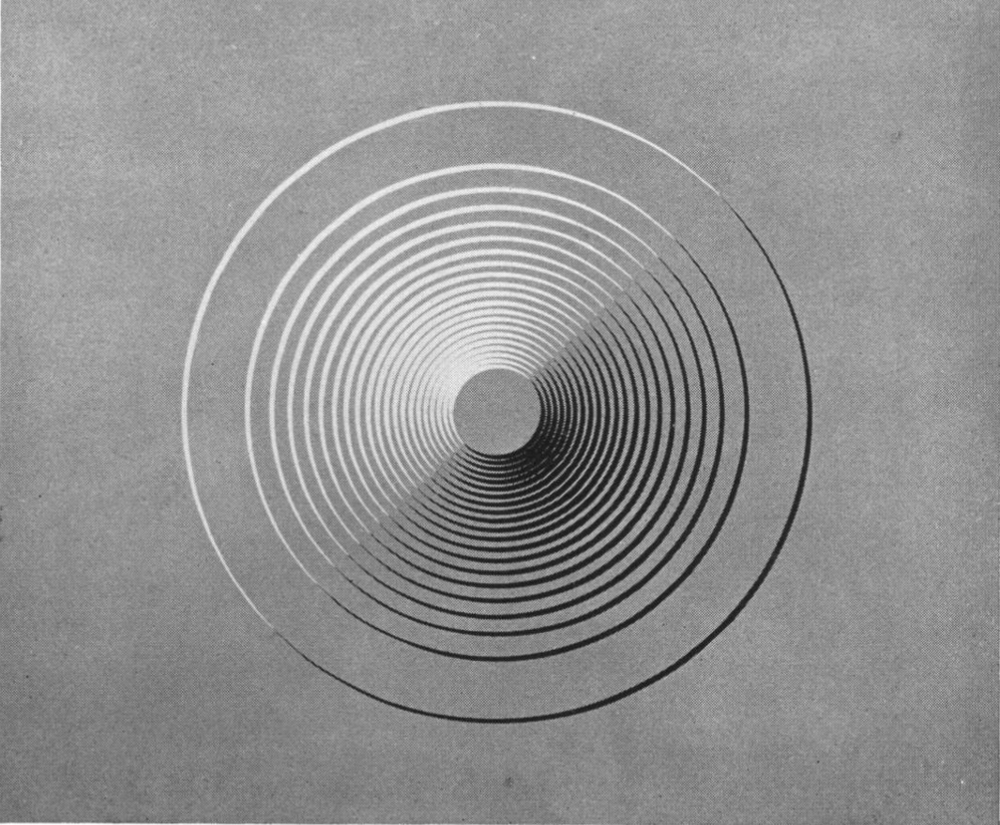
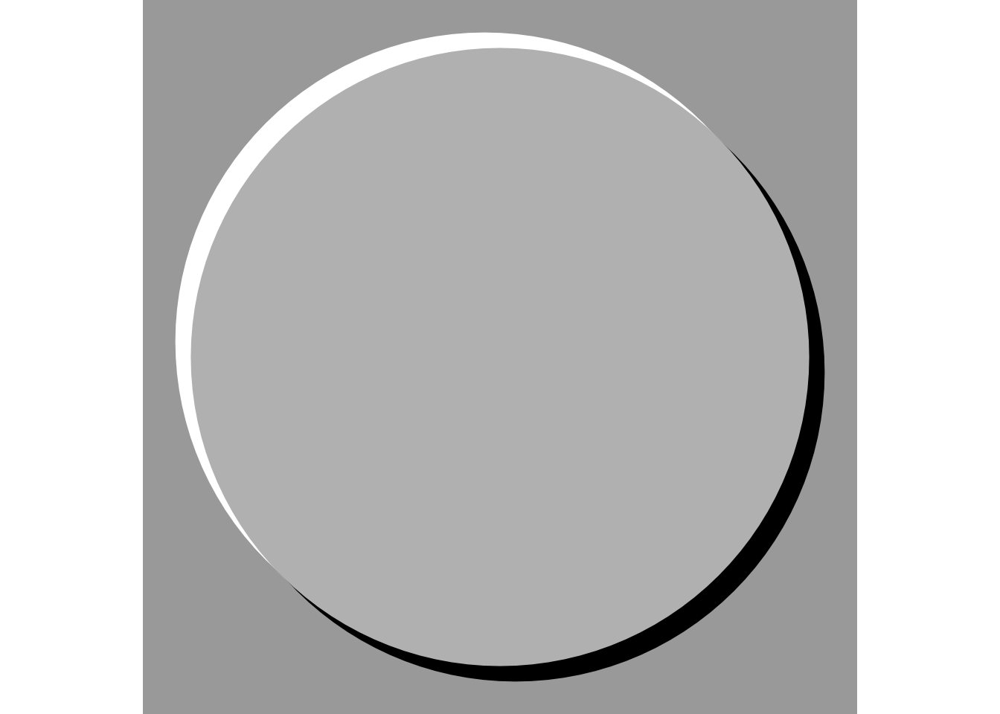
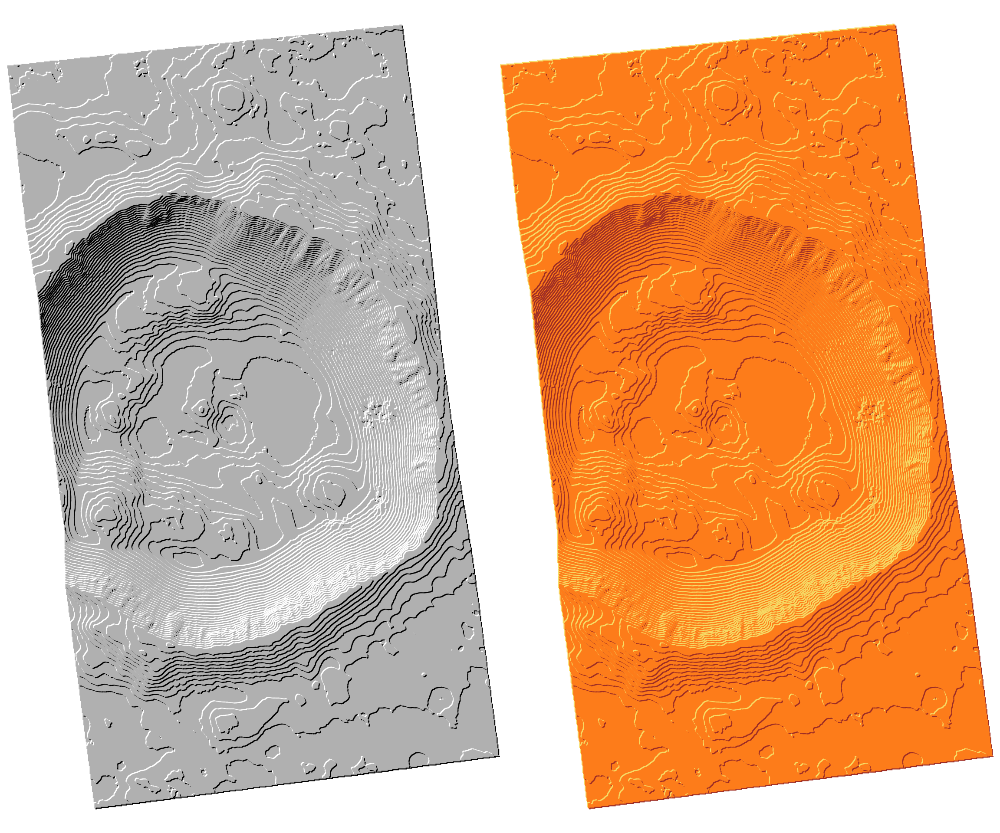
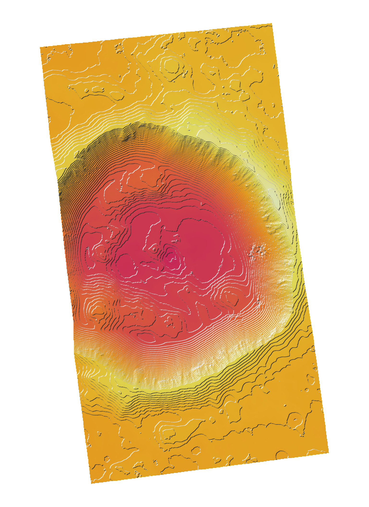
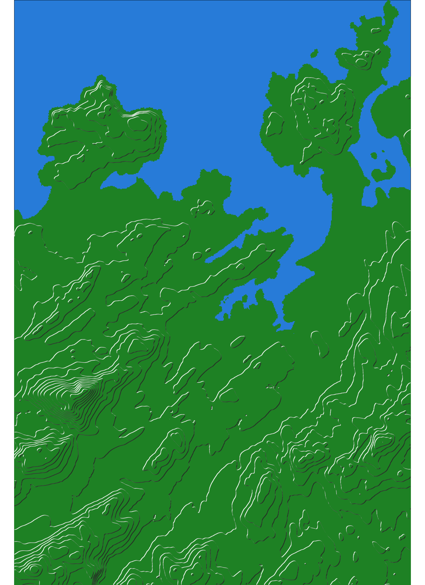
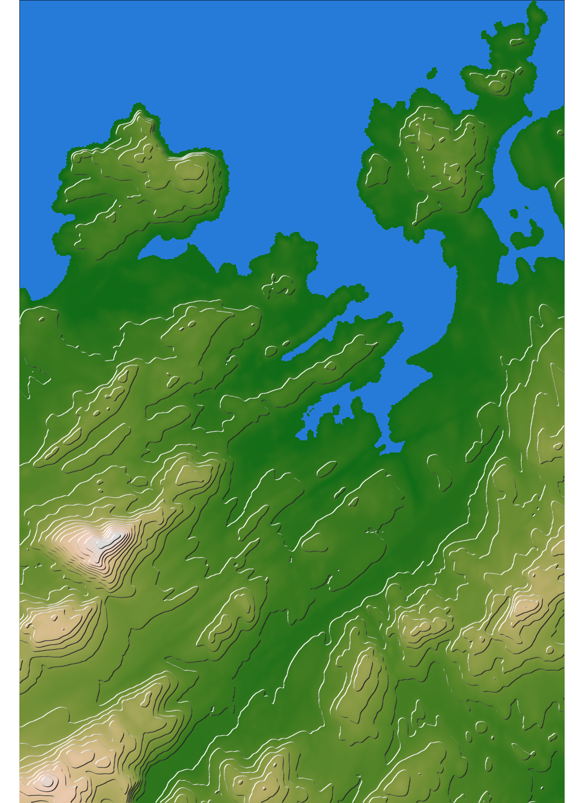

## 

{fig-align="center"}

##

Tanaka K. 1950. The relief contour method of representing topography on maps. _Geographical Review_ **40**(3) 444-456.

> A simple and exact method is available […]. If the tip of a drawing pen […] is filed down so that its thickness is the maximum thickness required in a contour line, and if […] the pen-point edge is kept at a fixed orientation […] parallel to the assumed horizontal direction of the incident light, then the thickness of the contour line will vary with the cosine of the angle. (1950, page 449)

## {data-background="tanaka-2.png"}

## {data-background="sheephaven-map.jpg" data-background-size="contain"} 

## {data-background="sam-keast-post.png" data-background-size="contain"} 

## The basic idea

```r
circle <- st_point(c(0, 0)) |>
  st_sfc() |>
  data.frame() |>
  st_as_sf(crs = 2193) |>
  st_buffer(1000)

circle_se <- circle |>
  mutate(geometry = geometry + c(50, -50)) |>
  st_set_crs(st_crs(circle))

circle_nw <- circle |>
  mutate(geometry = geometry + c(-50, 50)) |>
  st_set_crs(st_crs(circle))
```
##

```r
ggplot() +
  geom_sf(data = circle_se, fill = "black", colour = NA) +
  geom_sf(data = circle_nw, fill = "white", colour = NA) +
  geom_sf(data = circle, fill = "grey", colour = NA) +
  theme_void() +
  theme(panel.background = element_rect(fill = "darkgrey", colour = NA))
```

## The result

{fig-align="center"}

## Out of this world!



## We have a package for that!

::: {style="font-size:72px;"}
```r
library(metR)
```
:::

## Out of this world with colours

```r
ggplot(dem |> as.data.frame(xy = TRUE)) +
  geom_raster(aes(x = x, y = y, fill = z)) +
  scale_fill_continuous_c4a_seq(palette = "hcl.heat2") +
  guides(fill = "none") +
  geom_contour_tanaka( # <1>
    aes(x = x, y = y, z = z),
    binwidth = 20, sun.angle = 45) +
  coord_equal() +
  theme_void()
```
1. `geom_contour_tanaka` function is where the magic happens.

##



## And finally...

::: {.columns}
::: {.column}



:::
::: {.column}



:::
:::

## 

::: {.columns}
::: {.column}
### For more details and all the code
:::
::: {.column}

:::
:::
[geospatialstuff.com/posts/2025/11/18/tanaka-30-day-maps-2025-day-18/](https://geospatialstuff.com/posts/2025/11/18/tanaka-30-day-maps-2025-day-18/)


